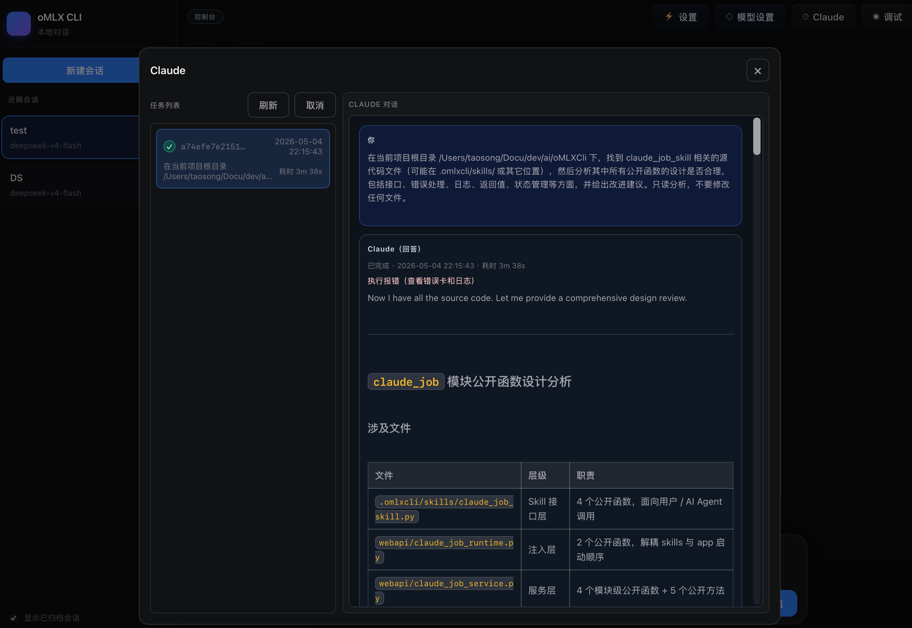
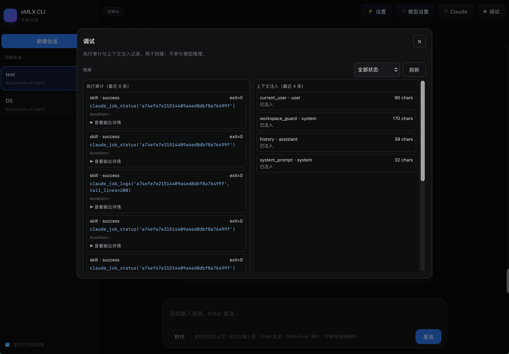

# oMLX CLI

<p align="center">
  <b>Self-hostable web assistant</b> for <b>OpenAI-compatible</b> LLMs — sessions, agent-style tools, multimodal chat, and a built-in skills toolkit.
</p>

<p align="center">
  <a href="README_en.md"><b>English documentation →</b></a>
  &nbsp;·&nbsp;
  <a href="README_cn.md"><b>← 中文文档</b></a>
</p>

<p align="center">
  
  
  
</p>

---

## At a glance

| | |
|--|--|
| **What** | Browser UI + **FastAPI** backend: stream chat, **run_shell** / **run_skill**, SQLite persistence, execution audit, layered context & checkpoints. |
| **Who** | Teams or individuals who already expose a **/v1/chat/completions**-style API and want a **polished local web** control plane—not a disposable demo. |
| **Docs** | Full install, configuration, features, testing, and contribution guide: **[README_en.md](README_en.md)** · **[README_cn.md](README_cn.md)** · HTTP API for custom UIs: **[docs/API.md](docs/API.md)** |

---

## 一览

| | |
|--|--|
| **是什么** | 浏览器工作台 + **FastAPI**：流式对话、**run_shell / run_skill**、SQLite 持久化、执行审计、分层上下文与 checkpoint。 |
| **适合谁** | 已有 **OpenAI 兼容推理服务**、希望用 **成熟 Web 界面** 完成日常助手与工具调用的个人或小团队。 |
| **详细说明** | 安装、环境变量、功能清单、测试与贡献流程请见：**[README_cn.md](README_cn.md)** · **[README_en.md](README_en.md)** · 自建前端 API：**[docs/API.md](docs/API.md)** |

---

## Reference environment · 维护者自测环境

**EN** · The table below is the **maintainer’s reference rig** used for day-to-day development and `smoke_all_skills.py` runs—it is **not** a minimum requirement. Your hardware and inference stack can differ as long as the API is **OpenAI-compatible**.

**中文** · 下表为 **维护者日常开发与技能冒烟** 所用参考配置，**不是**运行本项目的最低门槛；只要上游为 **OpenAI 兼容** API，硬件与推理栈可与下表不同。

| Item · 项目 | Reference · 参考配置 |
|---------------|----------------------|
| **Hardware · 硬件** | Apple MacBook Pro（M4 Max 12性能和4能效），统一内存 **128GB**（更大上下文与本地 STT 更从容） |
| **OS · 系统** | **macOS** Tahoe 26.4.1 (25E253) |
| **Python** | **3.12**，项目虚拟环境 **`.venv`**（`./bootstrap.sh`） |
| **Inference · 推理** | 本机或远端 **OpenAI 兼容** HTTP API；在 Web **Model settings** 写入 Base/Key/模型并存 SQLite；默认 model id 见代码 **`DEFAULT_SESSION_MODEL_ID`**（见 **`.env.example`** 第三节说明） |
| **Optional · 可选** | **PyMuPDF**（PDF）、**mlx-whisper**（Apple Silicon 本地转写）、**SearXNG / 网关**（`web_search`）、样例 PDF/图/音视频路径用于冒烟 |

### Screenshots · 技能与界面示意

**EN** · PNGs in `docs/readme/` are **resampled to ~900px width** (~160–210 KB each) for faster GitHub README loads. Replace the files when you update captures—keep the same names.


<p align="center">
  <b>Web UI · 会话与执行流</b><br/>
  
</p>

<p align="center">
  <b>Claude skills · Claude 任务管理</b><br/>
  
</p>

<p align="center">
  <b>Debug · 调试观测面板</b><br/>
  
</p>


---

## Claude Skills · 让专业工具做专业的事

- **定位**：`claude_job_*` 把“长耗时、跨步骤、可恢复”的任务交给 **Claude Code CLI** 后台队列执行，避免阻塞主对话。
- **方式**：在会话里由模型通过 `run_skill` 发起，返回 `job_id`；Web「Claude」面板只读监控（排队、运行、完成、失败、取消）。
- **共享上下文**：同一会话采用 `queued -> running` 串行调度，前序完成后自动续接（`--resume` 语义），减少重复启动与上下文丢失。
- **运维友好**：支持日志大小上限与保留清理（见 `.env.example` 第十一节），并可通过 `claude_job_status / claude_job_logs` 拉取过程与结果。
- **上线加固配置**：支持消息限流与体积限制（`OMLXCLI_MSG_RATE_LIMIT_*` / `OMLXCLI_MSG_MAX_*`）、以及多模态缓存 TTL 清理（`OMLXCLI_MEDIA_CACHE_*`）。

## Try in 30 seconds · 快速体验

```bash
git clone https://github.com/staoable/oMLX-CLI.git && cd oMLX-CLI
./bootstrap.sh && cp .env.example .env.local   # data dir, search, etc.; add Web “Model settings” in UI for chat keys
./start_web.sh
```

`bootstrap.sh` 默认会在 macOS 自动补齐系统依赖（`ripgrep`、`fd`、`ffmpeg`、`poppler`、`tesseract`）并安装 Playwright Chromium。若需跳过：
`AUTO_INSTALL_SYSTEM_DEPS=0 AUTO_INSTALL_PLAYWRIGHT_CHROMIUM=0 ./bootstrap.sh`

Then open **[http://127.0.0.1:8788/ui/](http://127.0.0.1:8788/ui/)** — or read **[README_en.md](README_en.md)** / **[README_cn.md](README_cn.md)** for ports, optional skills (PDF, search, Apple Silicon STT), and CI.

---

<p align="center">
  <a href="README_en.md">English →</a>
  &nbsp;·&nbsp;
  <a href="README_cn.md">中文 →</a>
</p>
