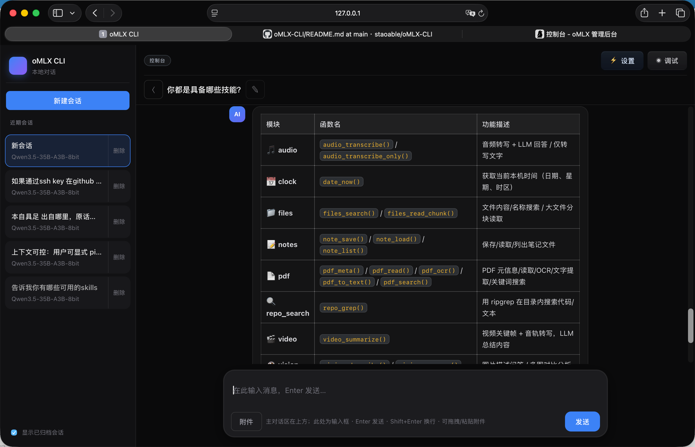
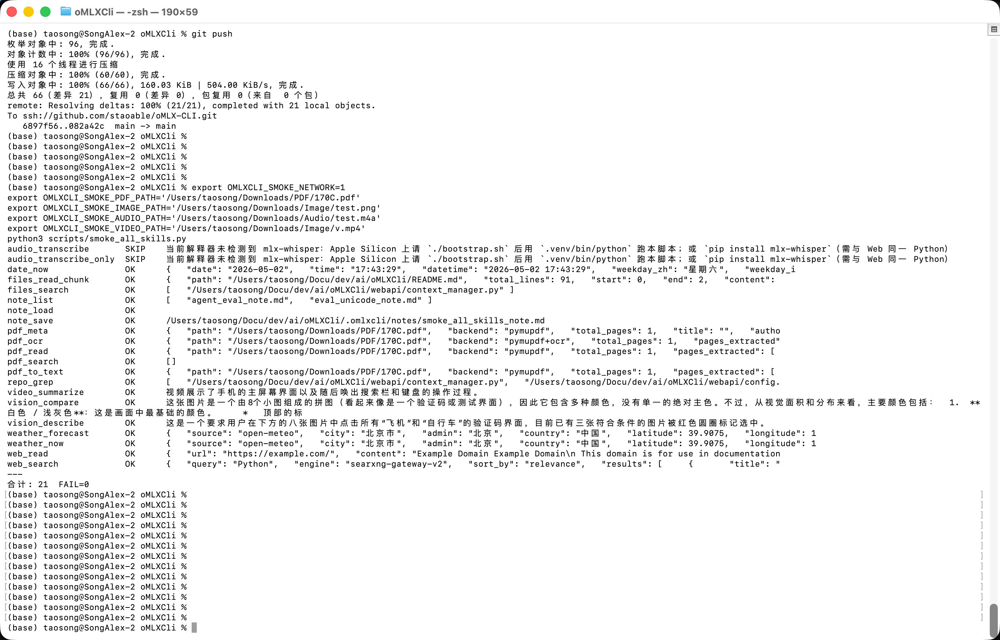

# oMLX CLI

<p align="center">
  <b>Self-hostable web assistant</b> for <b>OpenAI-compatible</b> LLMs — sessions, agent-style tools, multimodal chat, and a built-in skills toolkit.
</p>

<p align="center">
  <a href="README_en.md"><b>English documentation →</b></a>
  &nbsp;·&nbsp;
  <a href="README_cn.md"><b>← 中文文档</b></a>
</p>

<p align="center">
  
  
  
</p>

---

## At a glance

| | |
|--|--|
| **What** | Browser UI + **FastAPI** backend: stream chat, **run_shell** / **run_skill**, SQLite persistence, execution audit, layered context & checkpoints. |
| **Who** | Teams or individuals who already expose a **/v1/chat/completions**-style API and want a **polished local web** control plane—not a disposable demo. |
| **Docs** | Full install, configuration, features, testing, and contribution guide: **[README_en.md](README_en.md)** · **[README_cn.md](README_cn.md)** |

---

## 一览

| | |
|--|--|
| **是什么** | 浏览器工作台 + **FastAPI**：流式对话、**run_shell / run_skill**、SQLite 持久化、执行审计、分层上下文与 checkpoint。 |
| **适合谁** | 已有 **OpenAI 兼容推理服务**、希望用 **成熟 Web 界面** 完成日常助手与工具调用的个人或小团队。 |
| **详细说明** | 安装、环境变量、功能清单、测试与贡献流程请见：**[README_cn.md](README_cn.md)** · **[README_en.md](README_en.md)** |

---

## Reference environment · 维护者自测环境

**EN** · The table below is the **maintainer’s reference rig** used for day-to-day development and `smoke_all_skills.py` runs—it is **not** a minimum requirement. Your hardware and inference stack can differ as long as the API is **OpenAI-compatible**.

**中文** · 下表为 **维护者日常开发与技能冒烟** 所用参考配置，**不是**运行本项目的最低门槛；只要上游为 **OpenAI 兼容** API，硬件与推理栈可与下表不同。

| Item · 项目 | Reference · 参考配置 |
|---------------|----------------------|
| **Hardware · 硬件** | Apple MacBook Pro（M4 Max 12性能和4能效），统一内存 **128GB**（更大上下文与本地 STT 更从容） |
| **OS · 系统** | **macOS** macSo Tahoe 26.4.1 (25E253) |
| **Python** | **3.12**，项目虚拟环境 **`.venv`**（`./bootstrap.sh`） |
| **Inference · 推理** |  本机 oMLX + Qwen3.5-35B-A3B-8bit 搭建 **OpenAI 兼容** HTTP API（示例：`OI_API_BASE=http://127.0.0.1:<port>/v1`，`OI_MODEL` 与上游 `/v1/models` 中 id 一致） |
| **Optional · 可选** | **PyMuPDF**（PDF）、**mlx-whisper**（Apple Silicon 本地转写）、**SearXNG / 网关**（`web_search`）、样例 PDF/图/音视频路径用于冒烟 |

### Screenshots · 技能与界面示意

**EN** · Wireframe-style illustrations ship in-repo so the README renders on first clone. Swap them for **real PNG screenshots** anytime (same filenames under `docs/readme/`, e.g. `screenshot-web-ui.png`).

**中文** · 以下为仓库内置的 **SVG 线框示意图**（克隆即可在 GitHub 上正常显示）。你可随时用本机 **PNG 截图** 覆盖同路径文件名（如 `screenshot-web-ui.png`），便于展示真实 UI 与冒烟结果。

<p align="center">
  <b>Web UI · 会话与执行流（示意）</b><br/>
  
</p>

<p align="center">
  <b>Skills smoke · 全技能冒烟摘要（示意）</b><br/>
  
</p>

<p align="center"><sub>EN: Save real PNGs under <code>docs/readme/</code> as <code>screenshot-web-ui.png</code> and <code>screenshot-skills-smoke.png</code>, then change the two image URLs above from <code>.svg</code> to <code>.png</code>. · 中文：将真实截图保存为上述两个 PNG 文件名，并把 README 里两处图片扩展名改为 <code>.png</code>。</sub></p>

---

## Try in 30 seconds · 快速体验

```bash
git clone https://github.com/staoable/oMLX-CLI.git && cd oMLX-CLI
./bootstrap.sh && cp .env.example .env.local   # edit OI_API_BASE / OI_MODEL / OI_API_KEY
./start_web.sh
```

Then open **[http://127.0.0.1:8788/ui/](http://127.0.0.1:8788/ui/)** — or read **[README_en.md](README_en.md)** / **[README_cn.md](README_cn.md)** for ports, optional skills (PDF, search, Apple Silicon STT), and CI.

---

<p align="center">
  <a href="README_en.md">English →</a>
  &nbsp;·&nbsp;
  <a href="README_cn.md">中文 →</a>
</p>
